# ForgeCast

**15-minute-ahead industrial energy forecasting with leakage-safe time-series evaluation and an operational ML lifecycle.**

[Live Demo](https://forgecast.streamlit.app/) · [Architecture](docs/architecture.md) · [Model Lifecycle](docs/model_lifecycle.md) · [Validation](docs/validation.md)

## Overview

ForgeCast predicts the next 15-minute `Usage_kWh` value from historical industrial telemetry. The project is deliberately built as more than a notebook model: incoming records are validated, causal features are generated from state, forecasts are registered as events, later ground truth is paired back to those predictions, and the resulting residuals feed monitoring and retraining evaluation.

The implementation uses the UCI Steel Industry Energy Consumption dataset and a frozen scikit-learn `HistGradientBoostingRegressor`. The hosted interface provides a bounded historical replay so the same operational flow can be demonstrated in a browser.

## Problem

Short-horizon energy forecasting is easy to make look accurate when future information leaks into the feature set or when a random train/test split ignores time. Industrial telemetry also arrives as a sequence: missing intervals, duplicate messages, delayed labels, and state carried across observations all affect whether a forecast can be trusted.

ForgeCast treats temporal correctness as part of the ML problem. A forecast at time `t` must use information available by the forecast cutoff and target `Usage(t + 15 min)`. A simple persistence forecast is retained as a baseline so model improvement is measured against a reference that is available at inference time.

## Solution

ForgeCast uses a 96-observation stateful feature buffer. The primary 19-feature contract combines historical Usage lags and rolling statistics with target-time calendar features. Contemporaneous target-interval physical measurements and target-derived CO2 are excluded from the primary contract.

The runtime separates prediction from feedback. A forecast is stored against its target timestamp and is scored only when the actual target telemetry arrives. Positive telemetry gaps trigger explicit recovery: affected predictions are quarantined, state is reset, and the feature buffer must re-warm before forecasting resumes. No missing energy values are imputed in this path.

Retraining uses target-time partitions and an objective promotion gate. Candidate artifacts are stored separately from the active v1 replay artifact.

## System Overview

```mermaid
flowchart LR
    A[Telemetry Replay] --> B[Validation]
    B --> C[Stateful Features]
    C --> D[15-Min Forecast]
    D --> E[Prediction Event]
    E --> F[Delayed Ground Truth]
    F --> G[Residual + Baseline Metrics]
    G --> H[Monitoring]
    H --> I[Retraining Candidate]
    I --> J[Versioned Artifact]
```



## Key Capabilities

| Capability | What it demonstrates |
| --- | --- |
| Data contract | Exact schema, numeric/categorical validation, logical timestamp handling, and cadence checks. |
| Causal features | Bounded 96-step Usage history with target-time calendar features. |
| Leakage-safe evaluation | Expanding chronological windows with a persistence baseline. |
| Operational inference | Stateful prediction registration and exact target-time feedback pairing. |
| Missingness recovery | Gap detection, pending-prediction quarantine, state reset, and re-warm. |
| Monitoring | Cumulative, 24-hour, and 7-day ML-vs-persistence metrics from completed feedback. |
| Retraining | Target-time candidate partitions, promotion gates, and separate candidate artifacts. |
| Hosted demo | Streamlit browser interface using repository artifacts and the operational engine. |

## Results

The frozen v1 model was evaluated on three chronological held-out windows of 3,504 observations each.

| Evidence | ML MAE | Persistence MAE | ML MAE reduction | Observations |
| --- | ---: | ---: | ---: | ---: |
| Pooled chronological evaluation | 3.8626 kWh | 5.3688 kWh | **28.05%** | 10,512 |
| Post-training replay window | 3.2133 kWh | 4.2532 kWh | **24.45%** | 3,504 |

The second row corresponds to the final chronological holdout after the v1 training boundary. These numbers are historical out-of-sample replay results, not production plant performance.

The operational smoke replay processed all 35,040 source records and produced 34,945 predictions, 34,944 completed feedback records, one expected pending prediction, zero unmatched feedback events, zero duplicate feedback events, and zero sequence failures on the clean dataset.

## Tech Stack

Python · Pandas · NumPy · scikit-learn · Streamlit · pytest

The captured artifact environment uses Python 3.13.3, NumPy 2.4.6, Pandas 3.0.3, and scikit-learn 1.9.0. Model artifacts include companion metadata with version, feature contract, training boundary, data identity, and runtime versions.

## Demo

The hosted Streamlit application runs a bounded historical replay and shows the latest completed forecast, the matching persistence baseline and actual usage, recent forecast history, and the aggregate model result.

Open the [live demo](https://forgecast.streamlit.app/) to inspect the system without running the repository locally.

## Quick Start

Use Python 3.13.x to match the captured model artifact environment.

```bash
git clone https://github.com/nayanojwal0810/ForgeCast.git
cd ForgeCast
python -m venv .venv
source .venv/bin/activate
pip install -r requirements.txt
python -m pytest
streamlit run streamlit_app.py
```

The repository includes the raw dataset and serialized model artifacts used by the demonstration. The model artifact format is environment-sensitive, so matching the recorded runtime versions is recommended.

## Repository Structure

```text
ForgeCast/
├── artifacts/
│   ├── experiments/     # evaluation and retraining evidence
│   └── models/          # active and candidate model artifacts
├── data/raw/            # UCI source dataset
├── docs/                # architecture, lifecycle, validation
├── scripts/             # evaluation, smoke-test, retraining runners
├── src/forgecast/       # ingestion, replay, features, models, runtime
├── tests/               # unit and integration tests
├── requirements.txt
└── streamlit_app.py
```

## Limitations

ForgeCast demonstrates a controlled historical ML lifecycle, not enterprise production MLOps. The current system uses one industrial dataset/site, one forecast horizon, local file artifacts, in-memory runtime state, and a hosted historical replay. It has no live SCADA or telemetry connector, persistent model registry, distributed serving layer, probabilistic forecast intervals, or measured business-impact model.

Recent rolling windows can also favor persistence even when pooled chronological evidence favors ML. For that reason, the project exposes both baseline comparisons and rolling diagnostics rather than presenting a single point-in-time win as proof of general superiority.

## Future Improvements

The next engineering steps would be to connect live telemetry with durable state, introduce a persistent model registry and audit store, automate drift and retraining workflows, add probabilistic and multi-horizon forecasts, and evaluate the model against operational decisions such as peak-load mitigation or energy-cost reduction.

## Dataset

ForgeCast uses the [UCI Steel Industry Energy Consumption dataset](https://archive.ics.uci.edu/dataset/851/steel+industry+energy+consumption). The source provides industrial energy and related telemetry for the 2018 observation period. The repository preserves the source data used to build the replay workflow.

## Documentation

- [Architecture](docs/architecture.md) — runtime components, state flow, recovery, deployment surface, and design decisions.
- [Model Lifecycle](docs/model_lifecycle.md) — forecast contract, model artifact flow, feedback, monitoring, and retraining gates.
- [Validation](docs/validation.md) — leakage controls, chronological results, operational smoke evidence, missingness tests, and limitations.