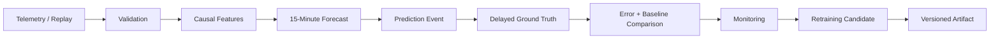

# ForgeCast

**15-minute-ahead industrial energy forecasting built as an end-to-end ML system, not just a model.**

[Live Demo](https://forgecast.streamlit.app/) · [Architecture](docs/architecture.md) · [Model Lifecycle](docs/model_lifecycle.md) · [Validation](docs/validation.md)

## Overview

ForgeCast predicts the next 15-minute industrial energy consumption value from historical telemetry. It validates each record, builds features using only information available at forecast time, produces a forecast, waits for the real target value, compares the forecast with a persistence baseline, and feeds the result into monitoring and retraining evaluation.

The project uses the UCI Steel Industry Energy Consumption dataset and a frozen scikit-learn `HistGradientBoostingRegressor`. The hosted Streamlit app runs a bounded historical replay through the same core runtime used by the tests.

Typical forecasting project:

```text
data -> model -> prediction
```

ForgeCast:

```text
telemetry -> validation -> causal features -> forecast
-> prediction registration -> delayed ground truth
-> baseline comparison -> monitoring -> retraining candidate
-> versioned artifact
```

## Why This Project

The interesting part is not only the model score. Short-horizon time-series ML can look better than it really is when future values leak into features, random splits ignore time, or delayed labels and missing intervals are handled loosely.

ForgeCast treats those as engineering problems. The implementation includes causal features, chronological holdout evaluation, a persistence baseline, exact prediction-to-ground-truth pairing, missing telemetry recovery, rolling monitoring, retraining candidate evaluation, and versioned model artifacts.

## Key Results

The frozen v1 model was evaluated on three expanding chronological holdout windows, each containing 3,504 observations.

| Metric | ForgeCast | Persistence |
| --- | ---: | ---: |
| Pooled MAE (mean absolute error) | **3.8626 kWh** | 5.3688 kWh |
| Pooled RMSE (root mean squared error) | **8.2464 kWh** | 12.1538 kWh |

**Result: 28.05% lower MAE than persistence across 10,512 held-out observations.**

The final post-training holdout also favored ForgeCast: 3.2133 kWh MAE versus 4.2532 kWh for persistence, a 24.45% reduction across 3,504 intervals.

Operational replay over the complete 35,040-row dataset produced 34,945 predictions and 34,944 completed feedback records. There was one expected pending prediction, with zero unmatched feedback events, zero duplicate feedback events, and zero sequence failures.

The latest full local test run recorded **106 passed**.

These are historical evaluation and replay results. They are not measurements from a live plant deployment.

## How It Works

### 1. Validate telemetry

The ingestion layer checks the 11-field source schema, numeric and categorical values, timestamp format, and 15-minute continuity. The dataset's daily `00:00` closing-row convention is mapped to a continuous logical timeline.

### 2. Build causal features

The feature generator keeps the most recent 96 contiguous Usage observations. It produces historical Usage lags and rolling means plus target-time calendar features and cyclical encodings.

Target-interval physical measurements are excluded because they are not available when the forecast is made. The target itself cannot enter the feature matrix.

### 3. Forecast the next interval

The active model is a frozen `HistGradientBoostingRegressor`. The forecast target is always:

```text
Usage(t + 15 min)
```

A persistence forecast, `Usage(t)`, is recorded alongside the ML prediction so every evaluation compares against a baseline available at inference time.

### 4. Wait for ground truth

Predictions are not scored immediately because the target has not arrived. The system stores the forecast by target timestamp. When the matching telemetry record arrives, it creates a feedback record containing the actual value, ML forecast, persistence forecast, and both errors.

### 5. Monitor performance

Completed feedback updates cumulative metrics and bounded 24-hour and 7-day windows. Short-window changes are visible without treating every window as proof of degradation.

### 6. Recover from missing telemetry

When a positive telemetry gap occurs, affected predictions are marked unscorable. Feature state is reset and the next segment must collect 96 contiguous observations before forecasting resumes. Missing Usage values are not imputed.

### 7. Evaluate retraining candidates

Candidate models are trained and validated using `target_timestamp` boundaries. A candidate must beat persistence by at least 5.0% to pass the implemented baseline gate. Candidate artifacts are kept separate from the active v1 artifact.

## Architecture



The detailed [architecture document](docs/architecture.md) covers state management, gap recovery, deployment, and the trade-offs behind the major design choices.

## Key Technical Features

| Feature | Why it matters |
| --- | --- |
| Leakage-safe time alignment | Prevents future target information from entering the forecast. |
| Chronological evaluation | Tests the model on later time periods instead of randomly shuffled rows. |
| Persistence baseline | Provides an inference-available sanity check. |
| Stateful inference | Keeps the runtime close to a streaming forecast loop. |
| Delayed feedback | Scores predictions only after their real targets arrive. |
| Missingness recovery | Prevents stale pre-gap history from contaminating later features. |
| Model-version tracking | Keeps feedback and metrics attributable to the generating artifact. |
| Retraining gate | Evaluates candidates with explicit temporal and performance criteria. |

## Tech Stack

Python · Pandas · NumPy · scikit-learn · Streamlit · pytest

Captured model metadata records Python 3.13.3, NumPy 2.4.6, Pandas 3.0.3, and scikit-learn 1.9.0. The active model is stored with companion metadata covering the feature contract, training boundaries, dataset identity, and runtime versions.

## Quick Start

```bash
git clone https://github.com/nayanojwal0810/ForgeCast.git
cd ForgeCast
python -m venv .venv
pip install -r requirements.txt
python -m pytest
streamlit run streamlit_app.py
```

Activate `.venv` with the normal command for your shell before installing packages if needed. The repository's `pyproject.toml` configures `src/` on the test path, and `streamlit_app.py` is the local and hosted entrypoint.

## Repository Structure

```text
ForgeCast/
├── artifacts/
│   ├── experiments/     # evaluation and retraining evidence
│   └── models/          # active and candidate model artifacts
├── data/raw/            # source telemetry dataset
├── docs/                # technical documentation
├── scripts/             # evaluation, smoke-test, retraining runners
├── src/forgecast/       # ingestion, features, models, runtime, UI
├── tests/               # unit and integration tests
├── requirements.txt
└── streamlit_app.py
```

## Limitations

ForgeCast demonstrates a controlled historical ML workflow. It is not an enterprise production system.

The current implementation uses one industrial dataset/site, one 15-minute forecast horizon, local file artifacts, in-memory runtime state, and historical replay. It does not include live SCADA/telemetry integration, a persistent model registry, distributed serving, probabilistic prediction intervals, or measured business impact.

Short windows can also favor persistence even when pooled chronological evidence favors ML. The documentation therefore reports both aggregate holdout results and rolling diagnostics.

## Future Improvements

Natural next steps are live telemetry ingestion with durable state, a persistent model registry and audit store, automated drift/retraining workflows, probabilistic and multi-horizon forecasting, and evaluation against operational decisions such as peak-load mitigation or energy-cost reduction.

## Dataset

ForgeCast uses the [UCI Steel Industry Energy Consumption dataset](https://archive.ics.uci.edu/dataset/851/steel+industry+energy+consumption). The repository contains the source CSV used for replay and evaluation.

## Documentation

- [Architecture](docs/architecture.md) — system flow, state, recovery, deployment, and design trade-offs.
- [Model Lifecycle](docs/model_lifecycle.md) — forecast definition, training, evaluation, feedback, monitoring, and retraining.
- [Validation](docs/validation.md) — model performance, system correctness, operational behavior, missingness tests, and evidence limits.