# Architecture

ForgeCast is built as a temporal system rather than a single model script. The same core flow is used for historical replay, operational inference, delayed feedback, monitoring, and candidate retraining.

## System Overview

```mermaid
flowchart LR
    A[Telemetry / Replay] --> B[Validation]
    B --> C[Stateful Features]
    C --> D[15-Minute Forecast]
    D --> E[Prediction Registration]
    E --> F[Delayed Ground Truth]
    F --> G[Feedback + Residuals]
    G --> H[Monitoring]
    H --> I[Retraining Candidate]
    I --> J[Versioned Model Artifact]
```

Every forecast follows one rule: telemetry through time `t` is used to predict `Usage(t + 15 min)`. The target is scored only after that future interval arrives.

## Runtime Flow

1. **Validate input.** The ingestion layer checks the 11-field source schema, numeric ranges, categories, timestamp format, and 15-minute continuity.
2. **Build state.** The feature generator keeps the latest 96 contiguous Usage observations. No prediction is emitted until this history is warm.
3. **Forecast.** The frozen `HistGradientBoostingRegressor` receives the canonical 19-feature vector. A persistence value, `Usage(t)`, is recorded beside the ML forecast.
4. **Complete feedback.** The next target record is matched to the earlier prediction by exact logical target timestamp.
5. **Monitor.** Completed pairs produce ML and persistence errors, cumulative metrics, and bounded 24-hour/7-day windows.
6. **Evaluate retraining.** Historical checkpoints build candidates from target-time-separated data and apply the promotion policy.

## Core Components

| Component | Role |
| --- | --- |
| `ingestion` | Enforces the 11-field source contract and the dataset's midnight timestamp convention. |
| `replay` | Streams the CSV sequentially through the validation contract. |
| `features` | Maintains the 96-step state and builds causal Usage + Calendar features. |
| `models` | Wraps the frozen estimator and stores active/candidate artifacts with metadata. |
| `operational` | Connects continuity checks, feedback pairing, stateful features, inference, and event registration. |
| `monitoring` | Compares ML with persistence using completed feedback only. |
| `retraining` | Creates chronological candidates, validates boundaries, and applies the promotion gate. |
| `ui` | Runs the bounded Streamlit demonstration on top of the core runtime. |

## State and Data Flow

The feature generator stores a bounded history of 96 Usage values and their logical timestamps. The longest lag and 24-hour rolling mean both depend on this contiguous state.

Pending forecasts are keyed by target timestamp. Once actual telemetry arrives, the tracker creates a `FeedbackRecord` containing the actual Usage, the original ML forecast, the persistence baseline, and both absolute errors. The model version stays attached to the record so monitoring can keep versions separate.

## Missing Data and Recovery

Duplicate and out-of-order records are rejected before they can corrupt state. A positive gap can use the recovery path instead of stopping the replay.

When a gap occurs, predictions whose targets fall inside the missing interval are marked unscorable, not scored as errors. Feature history is reset. The next segment must collect 96 contiguous observations before forecasting resumes. Missing Usage values are not imputed.

## Deployment

The hosted demo is launched through `streamlit_app.py`. The UI reads repository-relative artifacts and delegates forecast and monitoring logic to the `forgecast` package.

The runtime intentionally stays lightweight: local files, in-memory state, and a single Streamlit process. Kafka, Spark, Kubernetes, a database, and a separate model-serving API are outside the demonstrated scope.

## Major Design Decisions

| Decision | Why | Trade-off |
| --- | --- | --- |
| **Target-time partitions** | A one-step sample can have an earlier origin but a target in the next evaluation window. Target-time splits prevent that leakage. | Boundary logic is less intuitive than origin-time filtering. |
| **Stateful causal features** | Uses only information available at the forecast cutoff and mirrors a streaming forecast loop. | Warm-up and gap re-warm add operational state. |
| **Persistence baseline** | Available at prediction time and a useful sanity check for short-horizon demand. | Beating persistence does not prove value in every regime. |
| **No gap imputation** | Avoids fabricating history and contaminating later lag features. | Forecasting pauses until state is trustworthy again. |
| **Active/candidate separation** | Retraining experiments cannot silently change the hosted model. | Candidate acceptance still needs an explicit selection decision. |
| **File artifacts + metadata** | Keeps the project portable and reproducible. | Not a substitute for a shared production registry. |