# Architecture

ForgeCast is built as a temporal system rather than a single model script. The same core flow is used for historical replay, operational inference, delayed feedback, monitoring, and candidate retraining.

## System Overview

```mermaid
flowchart LR
    A[Telemetry / Replay] --> B[Validation]
    B --> C[Stateful Features]
    C --> D[15-Minute Forecast]
    D --> E[Prediction Registration]
    E --> F[Delayed Ground Truth]
    F --> G[Feedback + Residuals]
    G --> H[Monitoring]
    H --> I[Retraining Candidate]
    I --> J[Versioned Model Artifact]
```

Every forecast follows one simple rule: telemetry through time `t` is used to predict `Usage(t + 15 min)`. The target is scored only after that future interval arrives.

## Runtime Flow

1. **Validate input.** The ingestion layer checks the source schema, numeric ranges, categories, timestamp format, and 15-minute continuity.
2. **Build state.** The feature generator keeps the latest 96 contiguous Usage observations. No prediction is emitted until this history is warm.
3. **Forecast.** The frozen `HistGradientBoostingRegressor` receives the canonical 19-feature vector. A persistence value, `Usage(t)`, is recorded beside the model forecast.
4. **Complete feedback.** The next target record is matched to the earlier prediction by exact logical target timestamp.
5. **Monitor.** Completed pairs produce ML and persistence errors, cumulative metrics, and bounded 24-hour/7-day windows.
6. **Evaluate retraining.** Historical checkpoints build a new candidate from target-time-separated data and apply the promotion policy.

## Core Components

| Component | Role |
| --- | --- |
| `ingestion` | Enforces the 11-field source contract and normalizes the dataset's midnight convention. |
| `replay` | Streams the CSV sequentially so historical data follows the same temporal path as inference. |
| `features` | Maintains the 96-step state and builds causal Usage + Calendar features. |
| `models` | Wraps the frozen estimator and serializes the active/candidate artifacts with metadata. |
| `operational` | Connects continuity checks, feedback pairing, stateful features, inference, and event registration. |
| `monitoring` | Compares ML with persistence using completed feedback only. |
| `retraining` | Creates chronological candidates, validates boundaries, and applies the promotion gate. |
| `ui` | Runs a bounded Streamlit demonstration on top of the core runtime. |

## State and Data Flow

The feature generator stores a bounded history of 96 Usage values and their logical timestamps. The longest lag and 24-hour rolling mean both depend on this contiguous state.

Pending forecasts are keyed by target timestamp. Once actual telemetry arrives, the tracker creates a `FeedbackRecord` containing the actual Usage, the original ML forecast, the persistence baseline, and both absolute errors. The model version stays attached to the record so monitoring can keep versions separate.

## Missing Data and Recovery

Duplicate and out-of-order records are rejected before they can corrupt state. A positive gap can use the recovery path instead of stopping the replay.

When a gap occurs, predictions whose targets fall inside the missing interval are marked unscorable, not scored as errors. Feature history is then reset. The next segment must collect 96 contiguous observations before forecasting resumes. The system does not impute missing Usage values.

## Deployment

The hosted demo is launched through the repository-level `streamlit_app.py` entrypoint. The UI reads repository-relative artifacts and delegates forecast and monitoring logic to the `forgecast` package.

The runtime intentionally stays lightweight: local files, in-memory state, and a single Streamlit process. Kafka, Spark, Kubernetes, a database, and a separate model-serving API are outside the demonstrated scope.

## Major Design Decisions

| Decision | Why | Trade-off |
| --- | --- | --- |
| **Partition by target time** | A one-step sample can have an origin before the boundary while its ground truth is already in the next evaluation window. Target-time splits prevent that leakage. | Less intuitive than a simple origin-time split, so the boundary must be documented carefully. |
| **Stateful causal features** | The runtime can only use information available at the forecast cutoff. A bounded state also matches how a streaming forecaster would behave. | The first 95 records are warm-up and gaps require re-warm. |
| **Persistence baseline** | It is available at prediction time and gives a strong sanity check for short-horizon demand forecasting. | Beating persistence does not prove value in every regime. |
| **No gap imputation** | Fabricating missing Usage would create artificial history and can contaminate downstream features. | Forecasting pauses after a gap until state is trustworthy again. |
| **Separate active and candidate artifacts** | A retraining experiment should not silently change the hosted model. | Candidate acceptance still requires an explicit model-selection decision. |
| **File-based artifacts with metadata** | This keeps the project reproducible and simple to run. | It is not a substitute for a shared production model registry. |