# Architecture

ForgeCast is a stateful forecasting pipeline for one-step-ahead industrial energy prediction. It keeps the prediction contract, feature state, delayed feedback, monitoring, and model artifacts under one temporal flow.

## System Overview

```mermaid
flowchart LR
    A[Telemetry / Historical Replay] --> B[Schema + Domain Validation]
    B --> C[Temporal Continuity Check]
    C --> D[Stateful Feature Generator]
    D --> E[15-Minute Forecast]
    E --> F[Prediction Event]
    F --> G[Delayed Actual Feedback]
    G --> H[Residual + Baseline Metrics]
    H --> I[Monitoring]
    I --> J[Retraining Candidate]
    J --> K[Versioned Artifact]
```



The Streamlit application is a demonstration layer on top of this runtime. It delegates prediction and monitoring calculations to the same core components used by replay and operational tests.

## Runtime Flow

The system processes telemetry in timestamp order. Each accepted record is validated before it enters model state. After the feature generator has accumulated 96 contiguous observations, it can create the feature vector for the next 15-minute target.

For an observation at time `t`, the contract is:

```text
telemetry through t
    -> forecast Usage(t + 15 min)
    -> later receive actual Usage(t + 15 min)
```

The prediction event stores the model version, origin and target timestamps, prediction timestamp, forecast value, persistence baseline, and feature provenance. When the target record arrives, the feedback tracker pairs it by exact logical target timestamp.

## Core Components

| Component | Responsibility |
| --- | --- |
| Ingestion | Validate the 11-field telemetry schema, value domains, categories, and logical timestamp semantics. |
| Replay | Stream historical CSV rows sequentially through the validation contract; configurable delay supports demonstration replay. |
| Features | Maintain a bounded 96-observation Usage history and generate causal Usage + Calendar features for the next target. |
| Model | Run the frozen `HistGradientBoostingRegressor` under the canonical 19-feature contract. |
| Operational Engine | Orchestrate continuity checks, delayed feedback, feature state, inference, and prediction registration. |
| Monitoring | Compute cumulative, 24-hour, and 7-day ML-vs-persistence metrics from completed feedback only. |
| Retraining | Build chronological candidate datasets, evaluate candidates against persistence, and apply promotion gates. |
| Streamlit | Provide a bounded browser demonstration of the implemented forecasting lifecycle. |

## State and Data Flow

The feature generator keeps a strict in-memory buffer of the most recent 96 Usage observations. The longest historical input is `usage_lag_95`, and `usage_roll_mean_96` uses the same contiguous state.

The operational engine keeps pending predictions keyed by target timestamp. A completed `FeedbackRecord` contains the observed target, the ML forecast, the persistence baseline, and both absolute errors. Model-version information travels with the record so monitoring remains isolated by artifact version.

## Data Quality and Recovery

Schema and temporal validation fail closed on malformed values, duplicate timestamps, out-of-order records, and invalid cadence. The operational layer can recover from positive gaps when enabled.

The recovery policy does not impute missing energy measurements. Affected pending predictions are quarantined as unscorable, feature state is reset, and a new segment must collect 96 contiguous observations before forecasting resumes. This prevents stale pre-gap history from entering post-gap lag and rolling features.

## Deployment

The hosted demonstration uses Streamlit Community Cloud with `streamlit_app.py` as the repository entrypoint. Runtime files are resolved from repository-relative paths. The application loads the active v1 model artifact and reads stored evaluation/retraining summaries for presentation.

The design intentionally uses local files and in-memory state. It does not depend on Kafka, Spark, Kubernetes, a database, a separate API service, or a background worker. Those systems are outside the scope of this workload and evidence.

## Key Design Decisions

**Target-time alignment.** Training and validation partitions are defined by `target_timestamp`, not by the forecast origin. This prevents a one-step boundary sample from training on a future validation target.

**Causal state.** Feature generation consumes only telemetry that has logically arrived by the forecast cutoff, plus deterministic calendar properties of the target interval.

**No post-gap imputation.** Missing intervals invalidate affected predictions and force a state reset/re-warm instead of fabricating history.

**Active/candidate separation.** The active v1 artifact is immutable in the replay path. Later candidates are stored and evaluated separately.

**Artifact-based delivery.** Model binaries have companion metadata for version, feature contract, training boundary, data identity, and runtime versions.